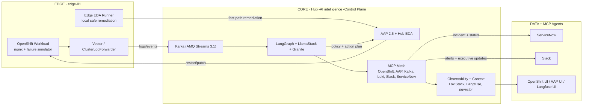

# Dark NOC — Architecture Overview

## Solution Summary

Dark NOC is an **Autonomous Network Operations Center** built on Red Hat OpenShift AI. It monitors edge web servers, detects failures via AI analysis, and remediates them automatically — all without human intervention for 94%+ of incidents.

---

## Infrastructure Topology



### Executive Flow Lanes

- `Telemetry lane`: edge logs stream to hub Kafka, then into AI + observability context.
- `Automation lane`: edge EDA runner handles immediate safe actions; hub AAP EDA executes orchestrated playbooks.
- `Governance lane`: MCP tools synchronize ServiceNow incidents, Slack communications, and UI evidence for leadership view.

---

## Complete Data Flow

### Incident Detection Flow (T+0 to T+12 seconds)

```
T+0s   Edge nginx pod crashes (OOMKilled)
T+1s   Edge Vector picks up crash log from /var/log/pods/
T+2s   Vector forwards JSON log to Hub Kafka (nginx-logs topic)
T+3s   Hub Kafka stores log in topic (replicated, persisted 7 days)

T+5s   PARALLEL TRACK A — EDA Fast Path:
         EDA Kafka source plugin matches OOMKilled pattern
         → Triggers AAP restart-nginx job template
         → Ansible playbook executes: rollout restart deployment/nginx

T+5s   PARALLEL TRACK B — AI Deep Analysis:
         LangGraph agent Kafka consumer reads message
         → RAG node: embed log → pgvector search → 3 runbook chunks
         → Analyze node: Granite 4.0 structured JSON output:
             {failure_type: "OOMKilled", confidence: 0.94,
              recommended_actions: ["restart nginx", "increase memory limit"],
              escalate_to_human: false, severity: "high"}

T+10s  AI validates EDA action + decides on permanent fix
       → Calls AAP MCP: launch "increase-memory" job (permanent fix)
       → Calls Slack MCP: send_alert with analysis context

T+12s  Slack notification delivered to #dark-noc-alerts
T+12s  Langfuse trace saved with full tool call chain
T+60s  nginx Running with increased memory limit
T+62s  Slack remediation message sent: "✅ nginx OOMKill remediated"
```

### Escalation Flow (for unknown failures)

```
T+0s   Edge nginx crash with unknown error pattern
T+5s   LangGraph analysis → confidence < 0.7 → escalate_to_human: true
T+6s   ServiceNow MCP: create_incident → INC0001234
T+7s   Slack MCP: send_incident_ticket → #dark-noc-alerts
T+8s   NOC engineer receives Slack DM with full context
T+9s   Incident-audit topic updated with escalation record
```

---

## Component Details

### Hub Cluster — Node 1 (m5.4xlarge) Workloads

| Component | Namespace | CPU | Memory | Role |
|-----------|-----------|-----|--------|------|
| MinIO | dark-noc-minio | 200m | 256Mi | Object storage (3 buckets) |
| Kafka KRaft | dark-noc-kafka | 500m | 1Gi | Event streaming |
| Langfuse PostgreSQL | dark-noc-observability | 100m | 256Mi | Metadata DB |
| Redis | dark-noc-observability | 50m | 64Mi | Cache/queue |
| ClickHouse | dark-noc-observability | 200m | 512Mi | OLAP traces |
| Langfuse Web | dark-noc-observability | 200m | 512Mi | AI observability |
| pgvector PostgreSQL | dark-noc-rag | 200m | 512Mi | RAG knowledge base |
| LokiStack | openshift-logging | 500m | 2Gi | Log storage |
| LlamaStack | dark-noc-hub | 200m | 512Mi | Agent framework |
| LangGraph Agent | dark-noc-hub | 200m | 512Mi | Autonomous NOC AI |
| 6x MCP Servers | dark-noc-mcp | 50m each | 64Mi each | Tool wrappers |
| AAP Controller | aap | 500m | 1Gi | Ansible execution |
| EDA Controller | aap | 200m | 512Mi | Event-driven automation |

### Hub Cluster — Node 2 (g5.2xlarge) Workloads

| Component | Namespace | CPU | Memory | GPU | Role |
|-----------|-----------|-----|--------|-----|------|
| vLLM + Granite 4.0 | dark-noc-hub | 4 | 12Gi | 1x A10G | AI inference |
| NVIDIA Drivers | nvidia-gpu-operator | - | - | - | GPU driver DaemonSet |

### Edge Cluster (m5.2xlarge) Workloads

| Component | Namespace | CPU | Memory | Role |
|-----------|-----------|-----|--------|------|
| nginx | dark-noc-edge | 50m | 128Mi | Monitored web server |
| Vector DaemonSet | openshift-logging | 100m | 256Mi | Log forwarding |
| ACM Klusterlet | open-cluster-management-agent | 100m | 128Mi | Hub-managed |

---

## Product Versions

| Product | Version | Key New Features Used |
|---------|---------|----------------------|
| OpenShift | 4.21 | DRA GPU scheduling, SNO |
| OpenShift AI | 3.3 | LlamaStack Operator, HardwareProfiles, vLLM 0.15.1 |
| ACM | 2.15 | Argo CD Pull Agent, Edge Manager (TP) |
| AMQ Streams | 3.1 | Kafka 4.x KRaft (no ZooKeeper) |
| AAP | 2.5 | EDA Kafka source, Unified Gateway |
| OpenShift Logging | 6.4 | Vector-only, LokiStack backend |
| Granite | 4.0 H-Tiny | Hybrid Mamba-2, MoE, 128K context |
| LlamaStack | 0.3.5 | RHOAI 3.3 built-in operator |
| LangGraph | 1.0 | PostgresSaver, interrupt(), Swarm |
| vLLM | 0.15.1 | xgrammar structured output, tool parser |
| Langfuse | 3.14.5 | ClickHouse OLAP, LLM-as-judge |
| FastMCP | 3.0.2 | Streamable HTTP transport |
| pgvector | 0.8.1 | HNSW index, iterative scans |

---

## Security Architecture

- **No inbound firewall openings**: ACM klusterlet + Kafka TLS all initiate from edge→hub
- **mTLS**: All hub microservices enrolled in Service Mesh (Istio ambient mode)
- **cert-manager**: Automatic TLS certificate rotation for all services
- **ServiceAccount tokens**: AAP uses scoped SA tokens for edge cluster access
- **Structured outputs**: vLLM xgrammar prevents prompt injection from log content
- **No plaintext secrets**: All credentials in Kubernetes Secrets (Sealed Secrets for production)
